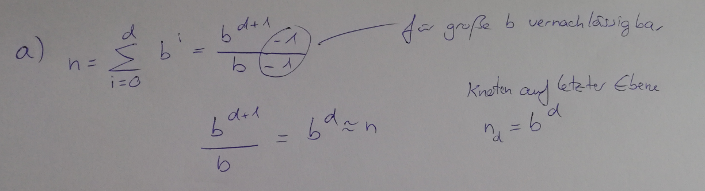

# Aufgabe 6.1

#### a) Beweisen Sie Satz 6.1, das heißt, dass bei einem Baum mit großem konstantem Ver-zweigungsfaktor b auf der letzten Ebene in Tiefe d fast alle Knoten liegen.

#### b) Zeigen Sie, dass dies nicht immer gilt, wenn der effektive Verzweigungsfaktor groß aber variabel ist
**Annahme**
- Sehr großer Verzweigungsfaktor
- Ebene d-1 hat Verzweigungsfaktor 1

**Ergebnis**
- N(d) = N(d-1)
- N(d) < Summe(N(0), N(d-1))