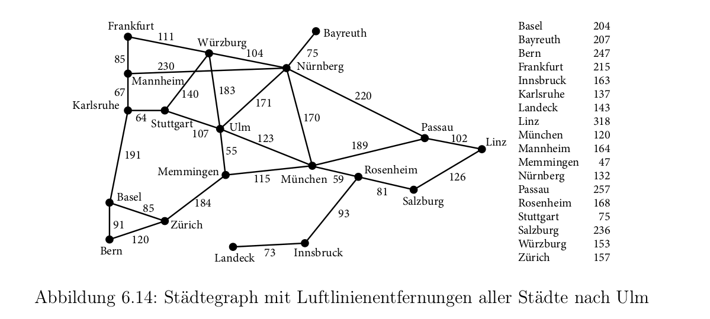

# Aufgabe 6.10

#### Konstruieren Sie für den Städtegraphen den Suchbaum mit A*-Suche und verwenden Sie als Heuristik die Luftlinienentfernung nach Ulm. Starten Sie in Bern mit Ziel Ulm. Beachten Sie, dass jeder Ort höchstens einmal pro Pfad auftritt.
