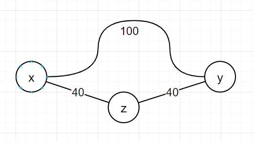

# Aufgabe 6.11

#### a) Zeigen Sie, dass für kürzeste Entfernungen auf Straßenkarten die Dreiecksungleichung gilt.
Strecke(x,y) ist kürzester Weg zwischen Ort x und y. Strecke(x,z) und Strecke(z,y) ist Weg von x zu y über Ort z. Da (x,y) kürzeste Strecke ist, kann (x,z)+(z,y) nicht kleiner sein. Demnach gilt: **(x,y) ≤ (x,z) + (z,y)**

#### b) Zeigen Sie anhand eines Beispiels, dass auf Straßenkarten sogar für direkte Nachbarknoten x und y bezüglich der Entfernung d(x, y) die Dreiecksungleichung nicht immer gilt. Das heißt, es gilt nicht d(x, y) ≤ d(x, z) + d(z, y).

