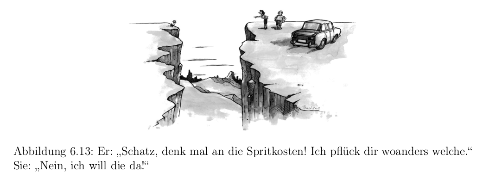

# Aufgabe 6.14

#### Welchen Bezug hat das Bild mit dem Ehepaar an der Schlucht zu einer zulässigen Heuristik?

Eine Heuristik unterschätzt üblicherweise die Entfernung zum Ziel, was in dem Bild von der Frau ebenfalls getan wird.
