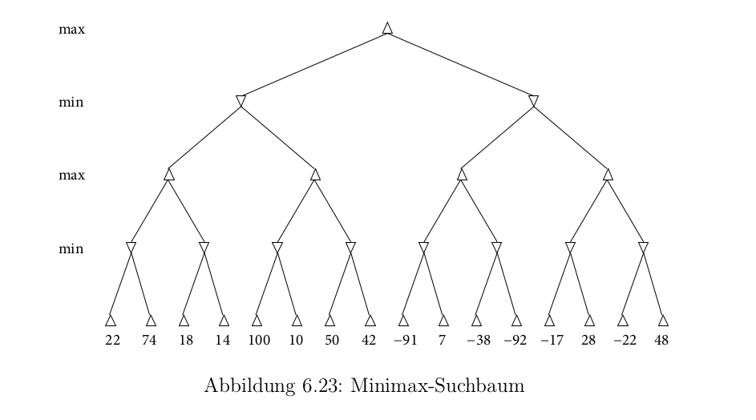

# Aufgabe 6.16

#### a) Gegeben ist der Suchbaum eines 2-Spieler-Spiels mit den Bewertungen aller Blattknoten. Verwenden Sie Minimax-Suche mit α-β-Pruning von links nach rechts. Streichen Sie alle nicht besuchten Knoten und geben Sie für jeden inneren Knoten die optimale resultierende Bewertung an. Markieren Sie den gewählten Pfad.

#### b) Testen Sie sich mit Hilfe eines der folgenden Applets:
- https://inst.eecs.berkeley.edu//~cs61b/fa14/ta-materials/apps/ab_tree_practice/
- http://homepage.ufp.pt/jtorres/ensino/ia/alfabeta.html
- https://raphsilva.github.io/utilities/minimax_simulator/