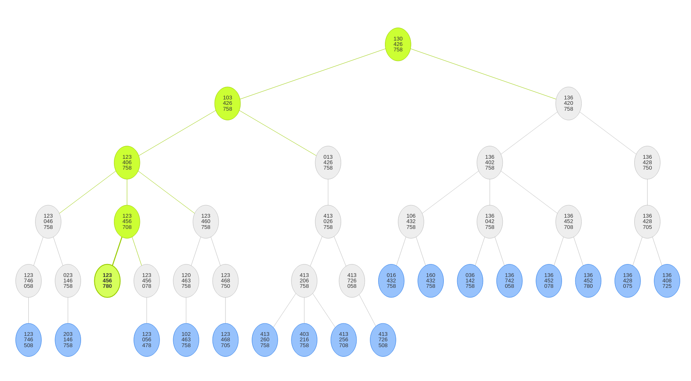

# Aufgabe 6.5

#### Suchen Sie (manuell) mit Breitensuche für das 8-Puzzle einen Pfad vom Startknoten
| 1 | 3 |   |
|---|---|---|
| 4 | 2 | 6 |
| 7 | 5 | 8 |
#### zum Zielknoten
| 1 | 2 | 3 |
|---|---|---|
| 4 | 5 | 6 |
| 7 | 8 |   |

