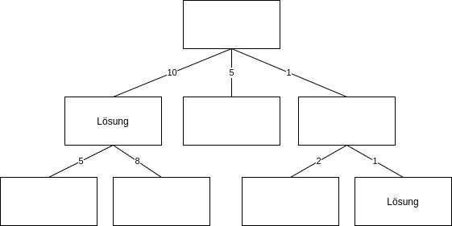

# Aufgabe 6.7

#### a) Zeigen Sie, dass die Breitensuche bei konstanten Kosten für alle Aktionen garantiert die kürzeste Lösung findet.
Da die Breitensuche jede Ebene fertig überprüft bevor sie zur Nächsten geht, wird eine Lösung weiter oben im Baum früher gefunden als eine weiter unten.

#### b) Zeigen Sie, dass dies bei variierenden Kosten nicht gilt.
Bei folgendem Baum würde die Lösung mit den Kosten 10 vor der Lösung mit den Kosten 2 gefunden werden

