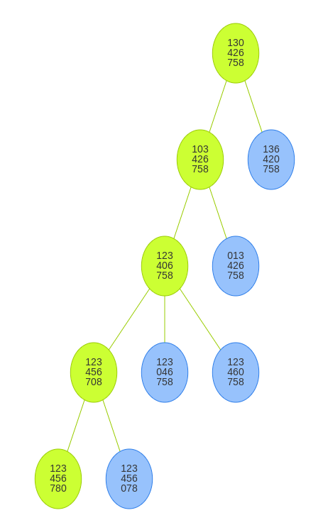

# Aufgabe 6.9

#### Suchen Sie (manuell) mit A*-Suche für das 8-Puzzle einen Pfad vom Startknoten
| 1 | 3 |   |
|---|---|---|
| 4 | 2 | 6 |
| 7 | 5 | 8 |
#### zum Zielknoten
| 1 | 2 | 3 |
|---|---|---|
| 4 | 5 | 6 |
| 7 | 8 |   |

#### a) unter Verwendung der Heuristik h1 (Abschnitt 6.3.5)
|Node|Kosten|
|---|---|
|1|4|
|2|3|
|3|5|
|4|2|
|5|4|
|6|1|
|7|3|
|8|3|
|9|0|
|10|2|

#### b) unter Verwendung der Heuristik h2 (Abschnitt 6.3.5)
|Node|Kosten|
|---|---|
|1|4|
|2|3|
|3|5|
|4|2|
|5|4|
|6|1|
|7|3|
|8|3|
|9|0|
|10|2|

